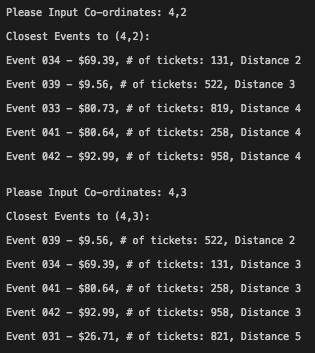

# Viagogo Coding Challenge
Solution to the programming challenge for Viagogo Software Engineer application, 2017. 

##Running instructions:

This solution to the "Viagogo Coding Challenge" runs using python 3, installed on macOS via XCode.

To run this program, simply input: `python3 event_finder.py` whilst in the same directory. Thank you for reading!

##Note:

Whilst writing this solution, I have worked with the following assumptions:

* Event order is prioritised on shortest Manhattan  distance to user above ticket price: A fully fledged system may consider a balance between the two e.g. factoring in travel costs etc.
* Users may make mistakes entering co-ordinates. I've added input checking to prevent entry of non-numerical values, and any co-ordinates exceeding the "world bounds" of -10 to +10.
* There is a minimum of 1 event occurring at any given time. As such, my random seeder for events has a lower bound of 1. The upper bound is arbitrarily set at 50, but may be increased.
* Number of tickets is randomly generated and included in the console output.
* As there is a maximum of 1 event per pair of co-ordinates, this solution automatically removes duplicates which may arise from the random generation.
* Users will want to make repeated entries of co-ordinates, as opposed to the program stopping after returning the first set of results. This solution assumes this, and scales the distances of nearby events accordingly: 

For example: 

##Considerations:

**How might you change your program if you needed to support multiple events at the
same location?**

This program could easily be extended to support multiple events at the same location. To stay within the challenge guideline (*Your program should assume that each co-ordinate can hold a maximum of one event.*), the current solution removes any events that are scheduled for duplicate co-ordinates. As such, modifying it to suit this constraint would be a case of removing line 18 of event\_finder.py: 
`list(events for events,_ in itertools.groupby(events))`. Each duplicate event scheduled for the same location would have a unique identifier to differentiate them, as well as unique ticket information concerning quantity and price.

**How would you change your program if you were working with a much larger world
size?**

If the world size was much larger, e.g. scaled to the real world, the program structure would change drastically.

For example, if we were working with the real world, I would write a program that instead prompts a user for their address information - such as their post code, or full address, parse that through a geocoder library such as geopy for python and determine the real world longitude and latitude of their location. In addition to this, events could be handled using a JSON file of locations, ticket prices and numbers, which could be read into the program via a dictionary (provided it isn't enormous in size!). From there, a similar program to this solution could be written, instead sorting the real world data by ordering it based on the Manhattan distance between a real world venue's location and the user. A few other considerations I would take into account would be distance vs ticket price, which would be a real life tradeoff for users in deciding which events they attend. 

At this point, I would have implemented a more object oriented approach to the program, having handler classes for reading and extracting the JSON data. There would also be a class for events and locations so as to decouple them, seeing as multiple events typically are hosted at one venue; often on the same day. The events would then store time, information, and tickets, with the locations being reponsible for storing the co-ordinates. This solves the problem of an event changing location.

If the world size scaled, I would possibly look into more efficient sorting algorithms for arranging the events in terms of proximity to the user, as this is likely to become a performance bottleneck. My current program uses Python's built in `sorted()` method to order ticket prices and Manhattan distances of events. Since `sorted()` creates a new list when it performs sorting, there may be more efficient options to consider when dealing with larger data sets. 